# Lotto Analysis Final Report

## Project Goal

This project analyzes historical Korean lotto data to answer three main questions:

1. Does the historical number distribution look materially different from a random process?
2. Can we build forecasting-oriented features from past draws without leakage?
3. Do simple or more complex models outperform random guessing in a meaningful way?

## Data Pipeline

The project uses a notebook-first workflow with a canonical raw Excel workbook.

- Raw workbook: `app/data/raw/lotto_history_latest.xlsx`
- Sync entry point: `python main.py sync`
- Current sync source: HTML round pages
- Processed dataset: `app/data/processed/lotto_cleaned.csv`

The raw data is standardized through preprocessing, validated, and saved as a clean tabular dataset for downstream notebooks and modules.

## Exploratory Analysis

The exploratory analysis focuses on:

- Main-number frequency vs. uniform expectation
- Bonus-number frequency vs. uniform expectation
- Odd-even and low-high balance
- Distribution of the total sum of the six main numbers
- Time-trend inspection
- Pairwise correlation between numbers

The purpose of this stage is to look for visible structural bias before applying formal tests.

Current saved report assets are present for this section and can be embedded directly from:

Current status:

- The saved EDA figures on disk should be regenerated once because the earlier notebook export used a generic `plt.gcf()` save pattern, which can produce duplicate blank images.
- The export cell in `02_eda.ipynb` has now been updated to save the actual returned figure objects.

Suggested saved outputs:

- Figure: `reports/figures/fig_01_main_number_frequency.png`
- Figure: `reports/figures/fig_02_bonus_number_frequency.png`
- Figure: `reports/figures/fig_03_odd_even_pattern.png`
- Figure: `reports/figures/fig_04_low_high_split.png`
- Figure: `reports/figures/fig_05_sum_distribution.png`
- Table: `reports/tables/table_02_main_number_frequency.csv`
- Table: `reports/tables/table_03_bonus_number_frequency.csv`

## Randomness Tests

The statistical testing stage compares real lotto outcomes against Monte Carlo baselines instead of relying on a single random sample.

The main checks include:

- Frequency comparison against a simulated random interval
- Chi-square test for uniformity
- KL divergence between real and simulated distributions
- Consecutive-draw overlap comparison

If these diagnostics remain broadly close to simulated random behavior, the data does not provide strong evidence that the drawing process is non-independent.

Current saved report assets are present for this section and can be embedded directly from:

Suggested saved outputs:

- Figure: `reports/figures/fig_06_real_vs_random_frequency.png`
- Figure: `reports/figures/fig_06b_consecutive_draw_overlap.png`
- Table: `reports/tables/table_04_random_frequency_comparison.csv`
- Table: `reports/tables/table_04_randomness_test_summary.csv`

## Feature Engineering

The feature set is forecasting-oriented rather than descriptive.

It currently includes:

- Rolling frequency features over recent draws
- Gap features measuring how long it has been since each number last appeared

These features are aligned so that each row uses only information available before the target draw.

Suggested saved outputs:

- Table: `reports/tables/table_08_feature_summary.csv`

## Contextual Extension

One realistic extension is to test whether draw profiles differ across contextual variables rather than trying to use those variables as strong predictors.

The most defensible starting point is calendar context:

- Month
- Season
- Year
- Day of month

These variables can be derived directly from draw dates without requiring new external scraping.

In the current notebook design, date context is constructed by mapping each round to its draw date and then deriving:

- `month` and `month_name`
- `season`
- `year`
- `day_of_month`

The contextual notebook now emphasizes two analysis layers:

- Number distribution analysis:
  compare the `1..45` number-frequency share across month, season, year, and day-of-month groups
- Pattern distribution analysis:
  compare grouped distributions of `sum_main`, `odd_count`, and `low_count` using boxplots and simple group tests

After that, the project can still be extended with optional external datasets:

- Weather merged by draw date, for example daily Seoul weather
- News intensity merged by draw week, for example article volume or topic counts

Those variables should be treated as exploratory covariates, not causal drivers of lotto outcomes.

Suggested saved outputs:

- Figure: `reports/figures/fig_11_context_month_number_heatmap.png`
- Figure: `reports/figures/fig_12_context_month_pattern_boxplots.png`
- Figure: `reports/figures/fig_13_context_season_number_heatmap.png`
- Figure: `reports/figures/fig_14_context_year_number_heatmap.png`
- Figure: `reports/figures/fig_15_context_year_pattern_boxplots.png`
- Figure: `reports/figures/fig_16_context_day_number_heatmap.png`
- Figure: `reports/figures/fig_17_context_day_pattern_boxplots.png`
- Table: `reports/tables/table_10_context_month_frequency_tests.csv`
- Table: `reports/tables/table_11_context_season_frequency_tests.csv`
- Table: `reports/tables/table_12_context_year_frequency_tests.csv`
- Table: `reports/tables/table_13_context_day_frequency_tests.csv`
- Table: `reports/tables/table_14_context_pattern_test_summary.csv`

## Weather Extension

The project now includes a weather-context layer built from KMA API Hub observations.

Current workflow:

- `weather-fetch`: fetch and cache raw weather observations
- `weather-build`: build draw-level context from the cached observations
- Canonical files:
  - `app/data/external/draw_metadata.csv`
  - `app/data/external/weather_observations.csv`
  - `app/data/external/weather_draw_context.csv`

Current saved weather report assets are present for this section and can be embedded directly from:

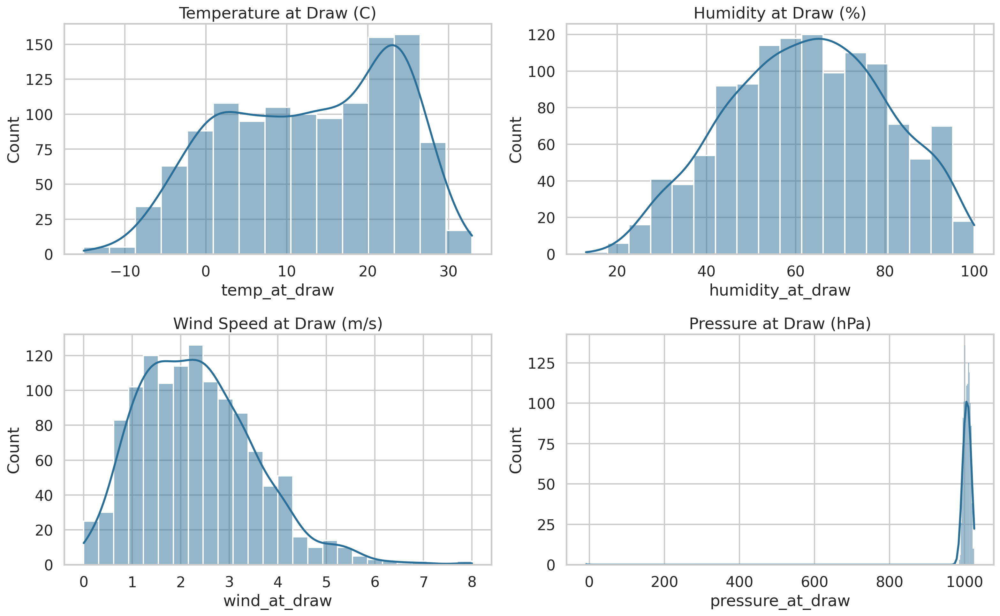
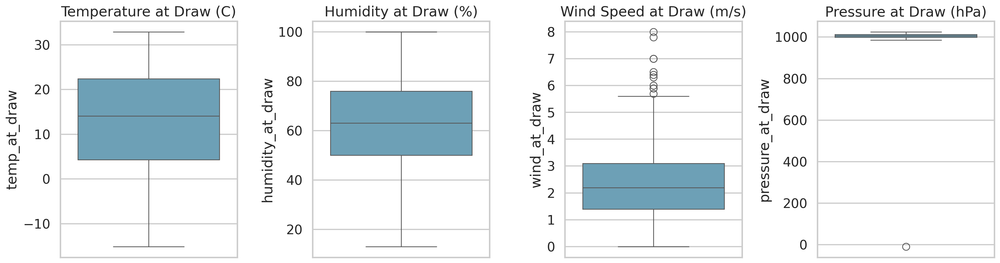
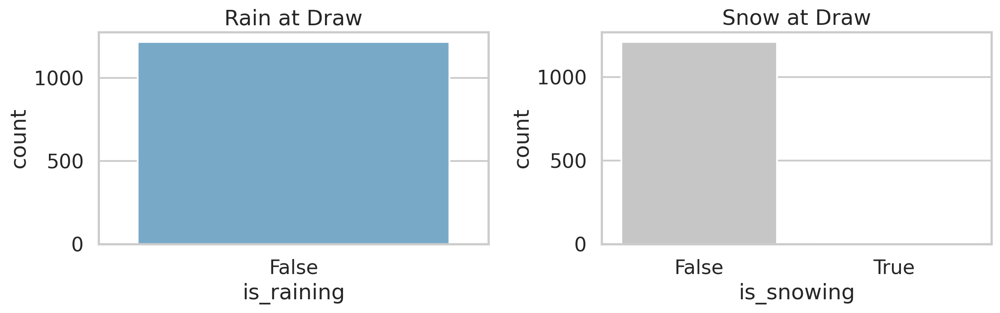
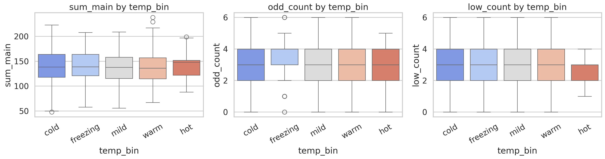
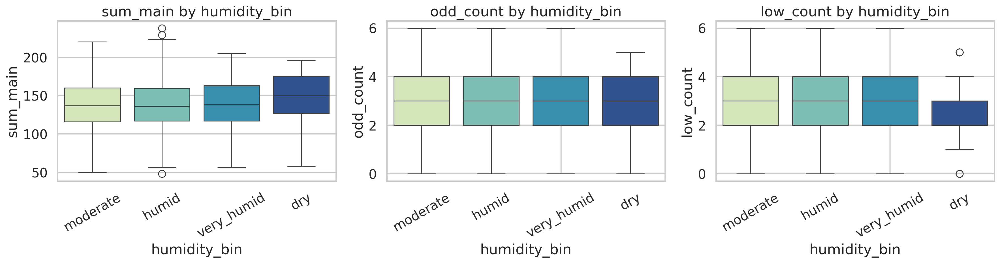
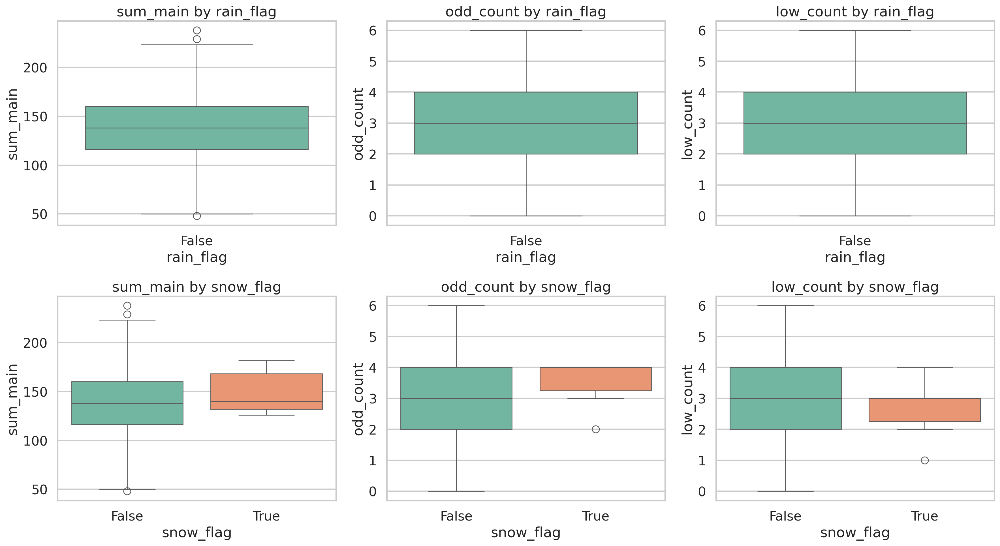
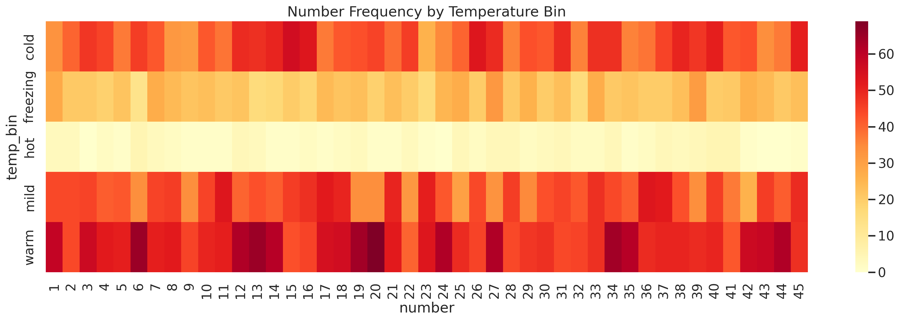
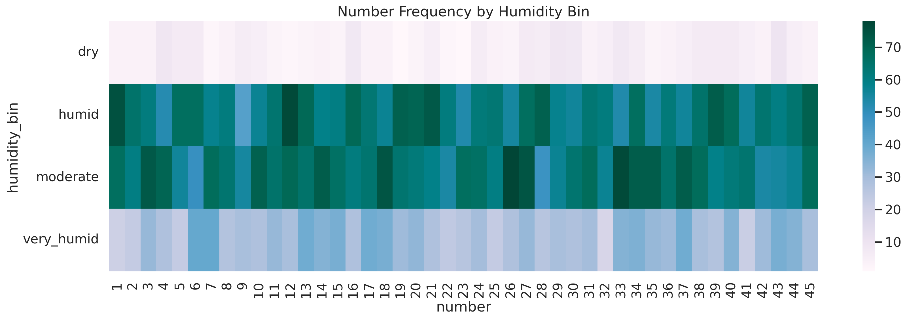

Suggested saved outputs:

- Figure: `reports/figures/fig_18_weather_distribution.png`
- Figure: `reports/figures/fig_19_weather_boxplots.png`
- Figure: `reports/figures/fig_20_weather_occurrence.png`
- Figure: `reports/figures/fig_21_weather_temp_pattern_boxplots.png`
- Figure: `reports/figures/fig_22_weather_humidity_pattern_boxplots.png`
- Figure: `reports/figures/fig_23_weather_binary_pattern_boxplots.png`
- Figure: `reports/figures/fig_24_weather_temp_number_heatmap.png`
- Figure: `reports/figures/fig_25_weather_humidity_number_heatmap.png`
- Table: `reports/tables/table_15_weather_quality_summary.csv`
- Table: `reports/tables/table_16_weather_occurrence_summary.csv`
- Table: `reports/tables/table_17_weather_pattern_test_summary.csv`
- Table: `reports/tables/table_18_weather_temp_number_frequency.csv`
- Table: `reports/tables/table_19_weather_humidity_number_frequency.csv`

Measured weather-data status from the latest saved tables:

- `temp_at_draw`, `humidity_at_draw`, `wind_at_draw`, `pressure_at_draw`, `precip_1h`, `precip_6h`, `precip_24h` are complete for all `1217` draws
- `daily_tavg`, `daily_tmin`, `daily_tmax`, `daily_precip_mm` are currently unavailable in the saved run
- `snow_at_draw` is sparse and only populated for a very small subset of draws
- `rain_flag` is currently zero across the saved context file, which indicates that the first weather build used an overly strict window-based rain proxy
- `snow_flag` is rare (`6` draws, about `0.5%`)

The weather context builder has now been updated so that rain is inferred from the nearest hourly observation (`RN`) and the same-hour cumulative daily rain field (`RN_DAY`) rather than only from a pre-draw aggregation window. After rerunning `weather-build`, `08_weather_context_analysis.ipynb`, and `09_weather_feature_modeling.ipynb`, the saved weather artifacts should be refreshed with a more realistic rain proxy.

Current statistical interpretation from `table_17_weather_pattern_test_summary.csv`:

- Kruskal tests for `sum_main`, `odd_count`, and `low_count` across `temp_bin` and `humidity_bin` do not show small p-values
- Mann-Whitney tests for snow vs. non-snow draws also do not show small p-values
- In the current saved run, the weather grouping variables do not provide strong evidence of large draw-pattern shifts

This does not prove that weather is irrelevant, but it does suggest that the currently available weather features act more like exploratory context than strong predictive signals.

## Weather-Aware Modeling

The weather-feature modeling notebook compares whether contextual variables add incremental predictive value beyond the original temporal baseline.

Current saved outputs for this stage are:

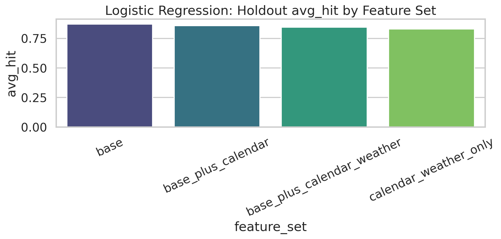
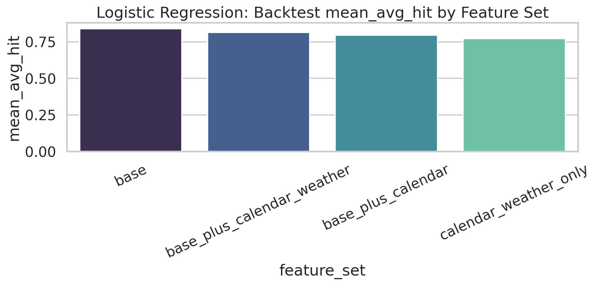
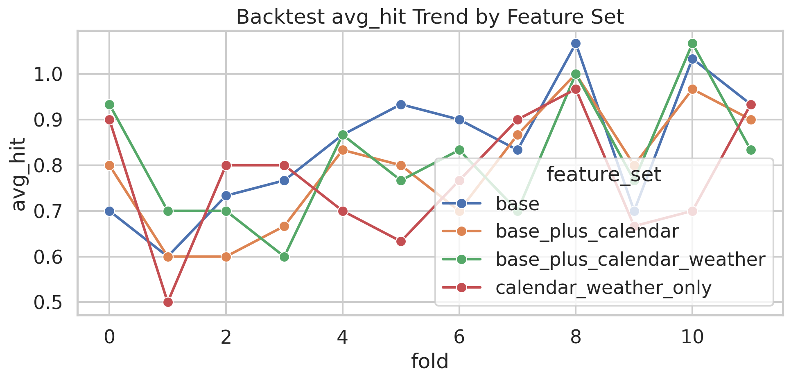

Suggested saved outputs:

- Figure: `reports/figures/fig_26_weather_feature_holdout_comparison.png`
- Figure: `reports/figures/fig_27_weather_feature_backtest_comparison.png`
- Figure: `reports/figures/fig_28_weather_feature_backtest_trend.png`
- Table: `reports/tables/table_20_weather_feature_holdout_summary.csv`
- Table: `reports/tables/table_21_weather_feature_backtest_summary.csv`
- Table: `reports/tables/table_22_weather_feature_backtest_results.csv`

Measured results from the latest `09_weather_feature_modeling.ipynb` run:

- Holdout `avg_hit`:
  - `base`: `0.8708`
  - `base_plus_calendar`: `0.8583`
  - `base_plus_calendar_weather`: `0.8458`
  - `calendar_weather_only`: `0.8208`
- Rolling backtest `mean_avg_hit`:
  - `base`: `0.8389`
  - `base_plus_calendar_weather`: `0.8111`
  - `base_plus_calendar`: `0.7944`
  - `calendar_weather_only`: `0.7667`

Interpretation:

- The existing temporal baseline remains the strongest feature set in both holdout and backtest comparisons.
- Calendar variables slightly reduce performance, and the current calendar+weather block reduces it further.
- Weather and calendar context are therefore more useful as explanatory covariates in this project than as direct performance-improving predictors in the current logistic-regression setup.

## Modeling

The modeling stage includes:

- Frequency heuristic baseline
- Gap heuristic baseline
- Random baseline
- Logistic regression
- Random forest
- XGBoost
- Classifier chain

Model outputs are saved so that evaluation can be run separately from model construction.

Suggested saved outputs:

- Table: `reports/tables/table_05_holdout_summary.csv`
- Table: `reports/tables/table_06_backtest_summary.csv`
- Table: `reports/tables/table_08_run_metadata.csv`
- Table: `reports/tables/table_09_model_output_paths.csv`
- Model artifact: `models/artifacts/logistic_regression.joblib`
- Model artifact: `models/artifacts/random_forest.joblib`
- Model artifact: `models/artifacts/xgboost.joblib`
- Model artifact: `models/artifacts/classifier_chain.joblib`

Current status:

- Summary tables were saved successfully.
- Serialized model artifacts are not yet present in `models/artifacts`.
- The most likely reason is that `05_model_baseline.ipynb` was executed before model persistence was added to `src/models/model_suite.py`, so the notebook output paths only include CSV and JSON files from that earlier run.
- The path layout has now also been reorganized so that model summaries and metadata are written under `models/results` and serialized estimators are written under `models/artifacts`.

## Evaluation

The evaluation stage reports:

- Holdout subset accuracy
- Holdout number-level accuracy
- Holdout average hit count
- Rolling backtest averages across folds
- Draw-level hit distributions

This split makes it easier to compare model families and judge whether added complexity produces a meaningful advantage over heuristics and random guessing.

Suggested saved outputs:

- Figure: `reports/figures/fig_07_holdout_model_comparison.png`
- Figure: `reports/figures/fig_08_draw_level_hit_distribution.png`
- Figure: `reports/figures/fig_09_backtest_model_comparison.png`
- Figure: `reports/figures/fig_10_backtest_trend.png`
- Table: `reports/tables/table_07_draw_level_results.csv`

Current status:

- Evaluation tables were saved successfully.
- The four evaluation figures currently on disk appear to be duplicates of the same exported image, so they should be regenerated by rerunning the final export cell in `06_model_evaluation.ipynb`.

## Measured Results

The latest saved run metadata indicates:

- Window size: `20`
- Train/test split ratio: `0.2`
- Random seed: `42`
- Feature rows used for modeling: `1197`
- Holdout rows: `240`
- Backtest folds: `19`

Holdout summary from `table_05_holdout_summary.csv`:

- Best `avg_hit`: `classifier_chain` at `0.900`
- Next best `avg_hit`: `logistic_regression` at `0.871`
- `random_baseline` remains close at `0.838`
- All models have `subset_accuracy = 0.0`

Backtest summary from `table_06_backtest_summary.csv`:

- Best `mean_avg_hit`: `random_baseline` at `0.872`
- `logistic_regression` is close at `0.868`
- `gap_heuristic` and `freq_heuristic` remain below those two
- Mean subset accuracy also stays at `0.0`

This means the saved tables are coherent and usable for reporting, even though the evaluation figure export needs one more refresh.

## Current Interpretation

At this stage, the project is designed less as a claim that lotto outcomes are predictable and more as a structured analysis of whether historical patterns provide usable predictive signal.

The key interpretation is:

- If the real data remains statistically close to simulated random baselines
- And if learned models remain close to heuristic or random performance

then the evidence for strong predictive structure in historical lotto data remains limited.

The current saved outputs fit that interpretation. Although `classifier_chain` leads the holdout `avg_hit`, the rolling backtest is led by `random_baseline`, and `logistic_regression` stays only marginally behind it. That gap is too small to support a strong claim that the learned models have discovered a robust predictive signal.

## Next Steps

Recommended follow-up work:

- Rerun `05_model_baseline.ipynb` so that summary files are written under `models/results` and `.joblib` model artifacts are written under `models/artifacts`
- Rerun the final export cell in `02_eda.ipynb` so that `fig_01` to `fig_05c` are regenerated correctly
- Rerun the final export cell in `06_model_evaluation.ipynb` so that `fig_07` to `fig_10` are regenerated correctly
- Run the full notebook pipeline and refresh saved outputs
- Execute the pytest suite regularly during refactoring
- Add CLI-level automation around the notebook workflow
- Expand this report by embedding the saved figures and tables from the latest notebook run
- Rerun weather-build, 8_weather_context_analysis.ipynb, and 9_weather_feature_modeling.ipynb after the updated rain-proxy logic so the saved weather outputs reflect non-window rain detection
- Test recent-round-only weather modeling (for example the most recent 300 to 500 draws) to see whether later-year context behaves differently from the full-history aggregate
- Add lagged weather-regime features such as dry/wet streak length, recent mean temperature, and short-term humidity regime shifts
- Compare extreme-weather subsets against matched non-extreme draws rather than only broad categorical bins
- Extend the feature-modeling notebook with tree-based importance summaries to see whether weather variables are consistently ignored or just weakly ranked

