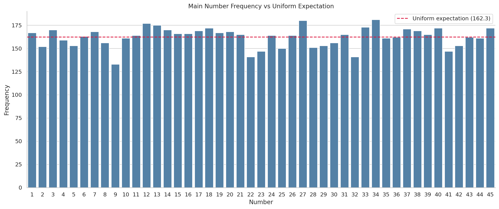
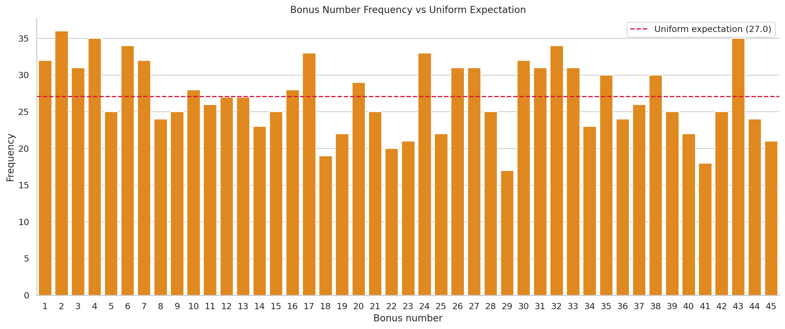
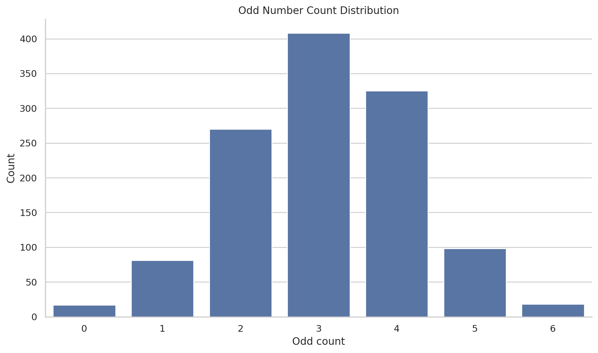
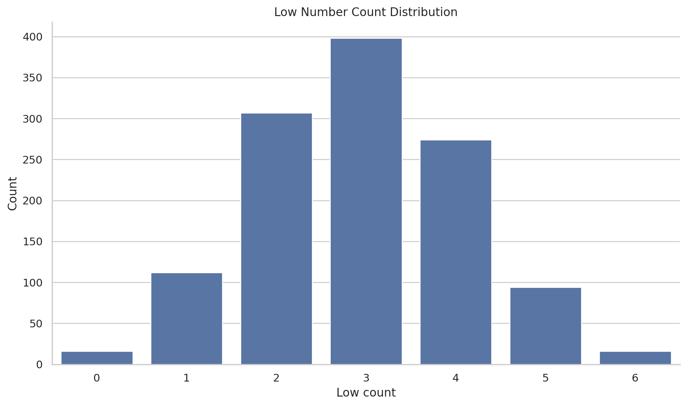
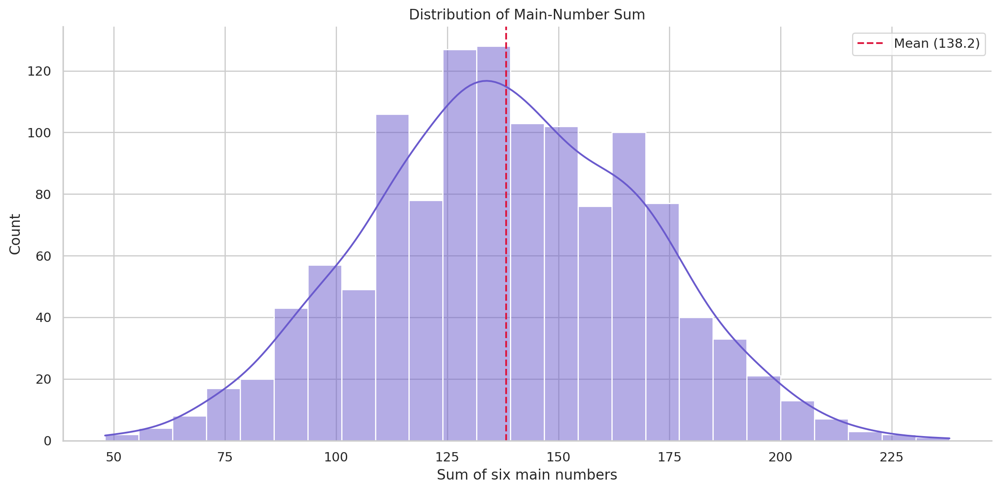
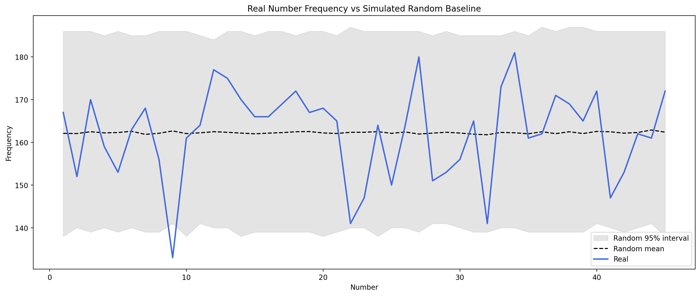
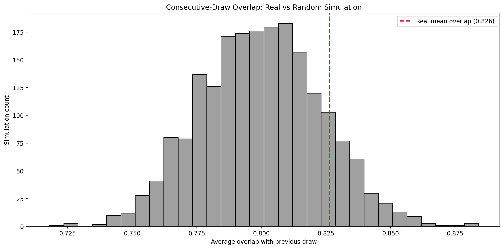

# Lotto Analysis Final Report

## Project Goal

This project analyzes historical Korean lotto data to answer three main questions:

1. Does the historical number distribution look materially different from a random process?
2. Can we build forecasting-oriented features from past draws without leakage?
3. Do simple or more complex models outperform random guessing in a meaningful way?

## Data Pipeline

The project uses a notebook-first workflow with a canonical raw Excel workbook.

- Raw workbook: `app/data/raw/lotto_history_latest.xlsx`
- Sync entry point: `python main.py sync`
- Current sync source: HTML round pages
- Processed dataset: `app/data/processed/lotto_cleaned.csv`

The raw data is standardized through preprocessing, validated, and saved as a clean tabular dataset for downstream notebooks and modules.

## Exploratory Analysis

The exploratory analysis focuses on:

- Main-number frequency vs. uniform expectation
- Bonus-number frequency vs. uniform expectation
- Odd-even and low-high balance
- Distribution of the total sum of the six main numbers
- Time-trend inspection
- Pairwise correlation between numbers

The purpose of this stage is to look for visible structural bias before applying formal tests.

Current saved report assets are present for this section and can be embedded directly from:

Current status:

- The saved EDA figures on disk should be regenerated once because the earlier notebook export used a generic `plt.gcf()` save pattern, which can produce duplicate blank images.
- The export cell in `02_eda.ipynb` has now been updated to save the actual returned figure objects.

Suggested saved outputs:

- Figure: `reports/figures/fig_01_main_number_frequency.png`
- Figure: `reports/figures/fig_02_bonus_number_frequency.png`
- Figure: `reports/figures/fig_03_odd_even_pattern.png`
- Figure: `reports/figures/fig_04_low_high_split.png`
- Figure: `reports/figures/fig_05_sum_distribution.png`
- Table: `reports/tables/table_02_main_number_frequency.csv`
- Table: `reports/tables/table_03_bonus_number_frequency.csv`

## Randomness Tests

The statistical testing stage compares real lotto outcomes against Monte Carlo baselines instead of relying on a single random sample.

The main checks include:

- Frequency comparison against a simulated random interval
- Chi-square test for uniformity
- KL divergence between real and simulated distributions
- Consecutive-draw overlap comparison

If these diagnostics remain broadly close to simulated random behavior, the data does not provide strong evidence that the drawing process is non-independent.

Current saved report assets are present for this section and can be embedded directly from:

Suggested saved outputs:

- Figure: `reports/figures/fig_06_real_vs_random_frequency.png`
- Figure: `reports/figures/fig_06b_consecutive_draw_overlap.png`
- Table: `reports/tables/table_04_random_frequency_comparison.csv`
- Table: `reports/tables/table_04_randomness_test_summary.csv`

## Feature Engineering

The feature set is forecasting-oriented rather than descriptive.

It currently includes:

- Rolling frequency features over recent draws
- Gap features measuring how long it has been since each number last appeared

These features are aligned so that each row uses only information available before the target draw.

Suggested saved outputs:

- Table: `reports/tables/table_08_feature_summary.csv`

## Modeling

The modeling stage includes:

- Frequency heuristic baseline
- Gap heuristic baseline
- Random baseline
- Logistic regression
- Random forest
- XGBoost
- Classifier chain

Model outputs are saved so that evaluation can be run separately from model construction.

Suggested saved outputs:

- Table: `reports/tables/table_05_holdout_summary.csv`
- Table: `reports/tables/table_06_backtest_summary.csv`
- Table: `reports/tables/table_08_run_metadata.csv`
- Table: `reports/tables/table_09_model_output_paths.csv`
- Model artifact: `models/artifacts/logistic_regression.joblib`
- Model artifact: `models/artifacts/random_forest.joblib`
- Model artifact: `models/artifacts/xgboost.joblib`
- Model artifact: `models/artifacts/classifier_chain.joblib`

Current status:

- Summary tables were saved successfully.
- Serialized model artifacts are not yet present in `models/artifacts`.
- The most likely reason is that `05_model_baseline.ipynb` was executed before model persistence was added to `src/models/model_suite.py`, so the notebook output paths only include CSV and JSON files from that earlier run.
- The path layout has now also been reorganized so that model summaries and metadata are written under `models/results` and serialized estimators are written under `models/artifacts`.

## Evaluation

The evaluation stage reports:

- Holdout subset accuracy
- Holdout number-level accuracy
- Holdout average hit count
- Rolling backtest averages across folds
- Draw-level hit distributions

This split makes it easier to compare model families and judge whether added complexity produces a meaningful advantage over heuristics and random guessing.

Suggested saved outputs:

- Figure: `reports/figures/fig_07_holdout_model_comparison.png`
- Figure: `reports/figures/fig_08_draw_level_hit_distribution.png`
- Figure: `reports/figures/fig_09_backtest_model_comparison.png`
- Figure: `reports/figures/fig_10_backtest_trend.png`
- Table: `reports/tables/table_07_draw_level_results.csv`

Current status:

- Evaluation tables were saved successfully.
- The four evaluation figures currently on disk appear to be duplicates of the same exported image, so they should be regenerated by rerunning the final export cell in `06_model_evaluation.ipynb`.

## Measured Results

The latest saved run metadata indicates:

- Window size: `20`
- Train/test split ratio: `0.2`
- Random seed: `42`
- Feature rows used for modeling: `1197`
- Holdout rows: `240`
- Backtest folds: `19`

Holdout summary from `table_05_holdout_summary.csv`:

- Best `avg_hit`: `classifier_chain` at `0.900`
- Next best `avg_hit`: `logistic_regression` at `0.871`
- `random_baseline` remains close at `0.838`
- All models have `subset_accuracy = 0.0`

Backtest summary from `table_06_backtest_summary.csv`:

- Best `mean_avg_hit`: `random_baseline` at `0.872`
- `logistic_regression` is close at `0.868`
- `gap_heuristic` and `freq_heuristic` remain below those two
- Mean subset accuracy also stays at `0.0`

This means the saved tables are coherent and usable for reporting, even though the evaluation figure export needs one more refresh.

## Current Interpretation

At this stage, the project is designed less as a claim that lotto outcomes are predictable and more as a structured analysis of whether historical patterns provide usable predictive signal.

The key interpretation is:

- If the real data remains statistically close to simulated random baselines
- And if learned models remain close to heuristic or random performance

then the evidence for strong predictive structure in historical lotto data remains limited.

The current saved outputs fit that interpretation. Although `classifier_chain` leads the holdout `avg_hit`, the rolling backtest is led by `random_baseline`, and `logistic_regression` stays only marginally behind it. That gap is too small to support a strong claim that the learned models have discovered a robust predictive signal.

## Next Steps

Recommended follow-up work:

- Rerun `05_model_baseline.ipynb` so that summary files are written under `models/results` and `.joblib` model artifacts are written under `models/artifacts`
- Rerun the final export cell in `02_eda.ipynb` so that `fig_01` to `fig_05c` are regenerated correctly
- Rerun the final export cell in `06_model_evaluation.ipynb` so that `fig_07` to `fig_10` are regenerated correctly
- Run the full notebook pipeline and refresh saved outputs
- Execute the pytest suite regularly during refactoring
- Add CLI-level automation around the notebook workflow
- Expand this report by embedding the saved figures and tables from the latest notebook run
